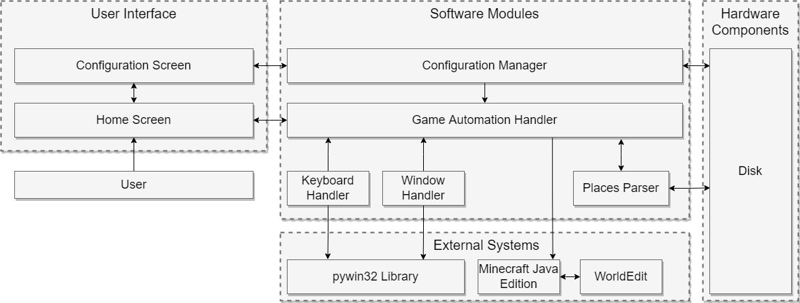

<!--
File:         README.md
Description:  Contains important information about the project in general

Author:       Kevin Green
Last Revised: 4 Feb 2022
-->

<!-- Title Card -->

<!-- Title -->
# Project B.A.T.

<!-- Subtitle/Brief Description -->
A Google Earth Pro to Minecraft Blueprint Automation Tool

<!-- Quick Links -->
[Documentation](https://github.com/comp195/senior-project-spring-2022-blueprint-automation-tool/wiki)

<!-- Authors -->

### Created By:
Kevin Green (k_green5@u.pacific.edu)

<!-- Badges -->

---

<!-- Table of Contents -->

Table of Contents

- [Project B.A.T.](#project-bat)
    - [Created By:](#created-by)
  - [Project Description](#project-description)
    - [About](#about)
  - [Technologies and Software Used](#technologies-and-software-used)
  - [Project Components](#project-components)

## Project Description
[[Back To Top](#title_card)]
### About
Project B.A.T. is a Blueprint Automation Tool that takes the saved "Places" from
Google Earth Pro and builds those places in Minecraft to scale. Specifically,
the application can take .kml and .kmz files saved by Google Earth Pro and
create a 2-D layout that players can later use to complete the actual building
with their creativity.

Project B.A.T. makes use of reference coordinates and map projections to handle
distortions to the map due from converting places from a ball earth to a
perfectly flat Minecraft world. The project also supports multiple blocks to
allow users to color-code and organize their layouts so that they are more
manageable.

## Technologies and Software Used
[[Back To Top](#title_card)]

## Project Components
[[Back To Top](#title_card)]

