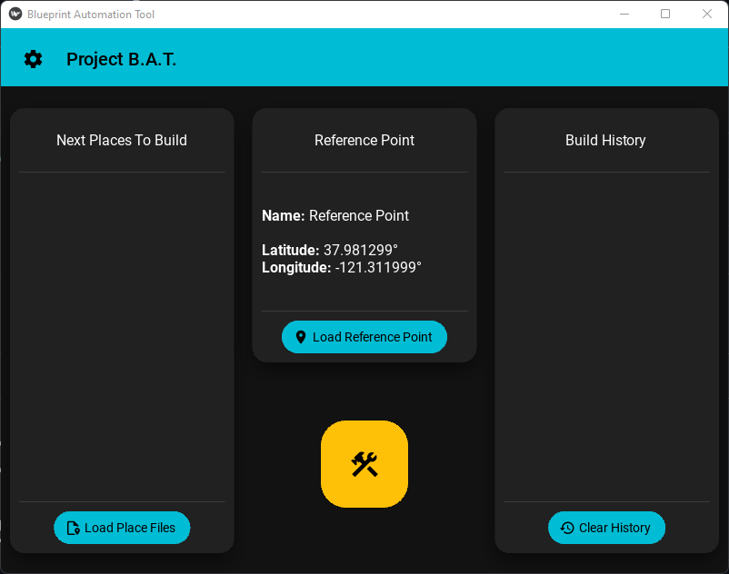
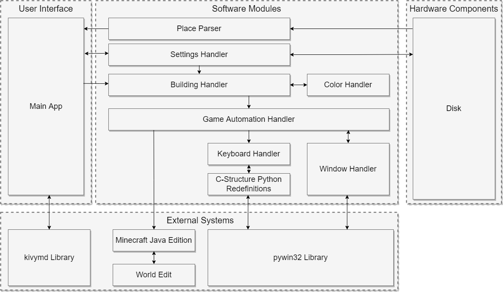

<!--
File:           README.md
Description:    Provides an introduction to the user.
-->

<!--Badges-->

# Project B.A.T

**A Google Earth Pro to Minecraft Blueprint Automation Tool**

<!--Explore The Wiki-->
[**Explore The Wiki ❯**](https://github.com/comp195/senior-project-spring-2022-blueprint-automation-tool/wiki)

<!--Quick Links-->
|
[Releases](https://github.com/comp195/senior-project-spring-2022-blueprint-automation-tool/releases) |
[Issues](https://github.com/comp195/senior-project-spring-2022-blueprint-automation-tool/issues) |
[Pull Requests](https://github.com/comp195/senior-project-spring-2022-blueprint-automation-tool/pulls) |

Table of Contents

- [About Project B.A.T](#about-project-bat)
  - [Project Description](#project-description)
  - [Features](#features)
- [Author](#author)
- [Getting Started](#getting-started)
  - [Prerequisites](#prerequisites)
    - [System Requirements](#system-requirements)
    - [Software Requirements](#software-requirements)
  - [Installation](#installation)
  - [Usage](#usage)
  - [Configuration](#configuration)
    - [Minecraft Version](#minecraft-version)
    - [Building Block](#building-block)
    - [Scale](#scale)
    - [Base Building Height](#base-building-height)
    - [Theme](#theme)
- [Project Components](#project-components)
  - [Built With](#built-with)
  - [System Architecture](#system-architecture)
- [Roadmap](#roadmap)
- [Acknowledgements](#acknowledgements)

## About Project B.A.T

### Project Description

Project B.A.T., also known as the **B**lueprint **A**utomation **T**ool, can take the saved "Places"
from Google Earth Pro and can build those Places in a Minecraft world to scale. Specifically, the
application takes .kml and .kmz files saved by Google Earth Pro and created a blueprinted layout that
players can later use to complete the builds with their creativity.

Project B.A.T. makes use of reference coordinates and distance calculations to handle distortions
that are created by converting places on a ball-shaped Earth to the perfectly flat Minecraft world.
The project also supports multiple block types and automatic color detection to allow users to
create an organized and color-coded layout that is easy for them to understand.

### Features

- Automatic building of .kml and .kmz files to the Minecraft world
- Automatic detection of place colors from Google Earth Pro for color-coding Minecraft blueprints
- Configurable settings for
  - Base Building Height
  - Building Block
  - Reference Points
  - Scale

## Author

Kevin Green - [k_green5@u.pacific.edu](mailto:k_green5@u.pacific.edu)

## Getting Started

### Prerequisites

#### System Requirements

**Supported Operating Systems**: Windows 10 / Windows 11

Systems that plan to run Project B.A.T. should meet the minimum requirements to run Minecraft. An
updated list of requirements required by Mojang can be found on their
[site](https://www.minecraft.net/en-us/get-minecraft).

_Note:_ Depending on the size of the blueprints that you intend to build, requirements may need to
be higher than those listed above in order to experience better performance in-game while the
layouts are being built.

#### Software Requirements

##### Minecraft Java Edition

**Supported Versions**: 1.12 - 1.18

Minecraft Java Edition can be installed through the game's
[site](https://www.minecraft.net/en-us).

##### World Edit

WorldEdit is a plugin/mod for Minecraft that allows players to quickly large structures in-game
without hainvg to place each block individually.

For instructions to install WorldEdit for the version of Minecraft you plan to build on, please
follow the instructions given on WorldEdit's [site](https://enginehub.org/worldedit/).

##### Google Earth Pro

Google Earth Pro is used to create the .kml/.kmz files that Project B.A.T. uses to create the
layouts. If are not creating your own custom .kml or .kmz files, you **do not** need to install this
program. For a working demo, multiple files are provided in the repository in `examples/sample_files`.

Google Earth Pro can be downloaded through Google's
[versions site](https://www.google.com/earth/versions/).

### Installation

To get Project B.A.T. running on your machine, downloaad the latest executable from the
[Releases](https://github.com/comp195/senior-project-spring-2022-blueprint-automation-tool/releases)
section of the repository. The executable can be ran from any folder on your machine.

### Usage

Follow these steps below for a basic usage of the application.

1. Start Minecraft and load into the world you would like to build your blueprint.
   - Project B.A.T. works best with the "superflat" world type in game.
2. Run `blueprint_automation_tool.exe`.
3. Click the button labeled `Load Reference Point`.
4. Open the .kml or .kmz file that you wish to use as the reference point for the layout. This
   point will be set at the world origin.
5. Clock on the button labeled `Load Place Files`.
6. Open all the .kml or .kmz files that you wish to have the application build. After opening the
   files, you should see all of them listed under "Next Places To Build".
7. Click the central button with the hammer and wrench. This will start the building process.
8. The application will start the automation to build the layout. During this time, **DO NOT**
   interact with your computer until the automation is complete and the blueprint automation tool
   has been set as the active window. Doing so may lead to unexpected results within the Minecraft
   world.
   - If you ned to stop the automation early for any reason hold down the `END` key and the
     application will stop at the next point when it is safe to do so.
9. Once the script is done building, it will bring you back to the application's window. At this
   point, you can safely interact with your system again.

### Configuration

The easiest way to configure the application is to use the application's configuration menu. This is
located in the top-left corner of the application with the cogwheel icon. Bringing this up will
show you all the options that are available to change.

#### Minecraft Version

Default Value: 1.18

The version of minecraft you are planning to build on. To update this, press the
`Detect Minecraft Version` button while you have the version of the game that you wish to build on
open.

#### Building Block

Default Value: Concrete

The block that you want the automation script to build with. Available blocks are listed in the
dropdown menu of the configuration menu.

#### Scale

Default Value: 100

The scaling factor of the build as a percentage. 100% is a 1:1 scale. Scaling can be set to any
percentage between 50% and 200% scale either through the textbox or the slider.

#### Base Building Height

Default Value: 0

The lowest point that builds will be built from. This is the ground level that all your blueprint
files will be built from.

#### Theme

Default Value: Dark Mode

Theme for the application. Either changes the application to use a light theme or a dark theme.

## Project Components

### Built With

### System Architecture

## Roadmap

Please check out the current [open issues](https://github.com/comp195/senior-project-spring-2022-blueprint-automation-tool/issues) to
see currently planned features (and known bugs).

Also be sure to checkout [`CHANGELOG.md`](docs/CHANGELOG.md) to see the history of changes for Project B.A.T.

## Acknowledgements

1. BuildTheEarth, "Build The Earth," _BuildTheEarth_, 2022. [Online]. Available: <https://buildtheearth.net/>. [Accessed: 19-Jan-2022].
2. EngineHub, "WorldEdit 7.2 Documentation," _WorldEdit Documentation_, 2022. [Online]. Available: <https://worldedit.enginehub.org/en/latest/>. [Accessed: 02-Feb-2022].
3. EngineHub, "WorldEdit," _EngineHub_. [Online]. Available: <https://enginehub.org/worldedit/>. [Accessed: 19-Jan-2022].

4. Google, "Earth versions - google earth", _Google_, 2022. [Online]. Available: <https://www.google.com/earth/versions/>. [Accessed: 19-Jan-2022].
5. H. Goebel, G. Bajo, D. Vierra, D. Cortesi, and M. Zibricky, “pyinstaller,” PyPI, 2022. [Online]. Available: <https://pypi.org/project/pyinstaller/>. [Accessed: 19-Jan-2022].
6. ImagineFun, “Imagine fun,” Imagine Fun, 2021. [Online]. Available: <https://imagineeringfun.net/>. [Accessed: 19-Jan-2022].
7. KivyMD, “KivyMD”, GitHub, 2022. [Online]. Available: <https://github.com/kivymd/KivyMD>. [Accessed:  08-Apr-2022].
8. M. Hammond, “Python for Win32 Extensions Help,” GitHub.io, 2022. [Online]. Available: <https://mhammond.github.io/pywin32/>. [Accessed: 02-Feb-2022].
9. M. Hammond, “pywin32,” PyPI, 2022. [Online]. Available: <https://pypi.org/project/pywin32/>. [Accessed: 19-Jan-2022].
10. MCParks, MCParks, 2022. [Online]. Available: <https://mcparks.us/>. [Accessed: 19-Feb-2022].
11. “Minecraft Wiki,” Minecraft Wiki – The Ultimate Resource for Minecraft, 2022. [Online]. Available: <https://minecraft.fandom.com/wiki/Minecraft_Wiki>. [Accessed: 02-Feb-2022].
12. Mojang, “Get minecraft,” Minecraft.net, 21-Sep-2021. [Online]. Available: <https://www.minecraft.net/en-us/get-minecraft>. [Accessed: 19-Jan-2022].
13. Mojang, “Minecraft official site,” Minecraft.net, 10-Nov-2021. [Online]. Available: <https://www.minecraft.net/en-us>. [Accessed: 19-Jan-2022].
14. Python Software Foundation, “Welcome to Python.org,” Python.org, 2022. [Online]. Available: <https://www.python.org/>. [Accessed: 19-Jan-2022].

<!--Useful Links
Table of Unicode Characters:    https://unicode-table.com/en/
List of Markdown Badges:        https://github.com/Ileriayo/markdown-badges
GitHub Emoji Cheat Sheet:       https://github.com/ikatyang/emoji-cheat-sheet
-->
