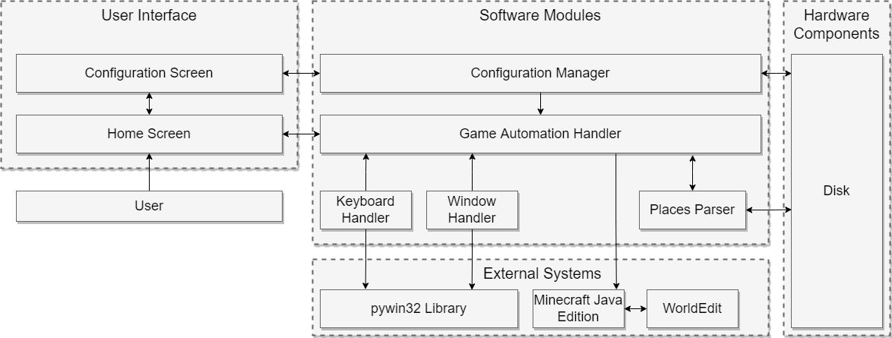

<!--
File:         README.md
Description:  Provides an introduction to the project.
-->

<!--Badges-->
![GitHub Commit Activity][shield-github-commit-activity]
![GitHub Last Commit][shield-github-last-commit]
![GitHub Watchers Count][shield-github-watchers-count]
![GitHub Top Language][shield-github-top-language]
![GitHub Latest Release][shield-github-latest-release]
![GitHub Open Issues][shield-github-open-issues-count]
![GitHub Closed Issues][shield-github-closed-issues-count]

<!--Project Title-->
# Project B.A.T.

<!--Subtitle-->
**A Google Earth Pro to Minecraft Blueprint Automation Tool**

<!--Explore the Wiki-->
[Explore the Wiki &#10095;][url-wiki]

---

<!--Table of Contents-->

  
Table of Contents

  - [About Project B.A.T.](#about-project-name)
    - [Overview](#overview)
    - [Features](#features)
  - [Authors](#authors)
  - [Getting Started](#getting-started)
    - [Prerequisites](#prerequisites)
  - [Project Components](#project-components)
    - [Built With](#built-with)
    - [System Architecture](#system-architecture)
  - [Roadmap](#roadmap)

[<a href="#title_card">Back To Top</a>]

## About Project B.A.T.

### Overview

Project B.A.T. stands for **B**lueprint **A**utomation **T**ool, which can take the saved "Places" from Google Earth Pro and can build those places in Minecraft to scale. Specifically, this application takes .kml and .kmz files saved by Google Earth Pro and creates a blueprinted layout that players can later use to complete the actual building with their creativity.

Project B.A.T. makes use of reference coordinates and map projections to handle distortions that are created by converting places on a ball-shaped Earth to a perfectly flat Minecraft world. The project also supports multiple block choices to allow users to create an organized and color-coded layout that is easy to understand.

### Features

- Automatic building of .kml and .kmz files to the Minecraft world.
- Configurable settings for build height, block choice, and reference coordinates.
- Automation detection of colors from Google Earth Pro to translate into the most appropriate block.

[<a href="#title_card">Back To Top</a>]

## Author

Kevin Green | email: k_green5@u.pacific.edu

[<a href="#title_card">Back To Top</a>]

## Getting Started

### Prerequisites

**Windows 10/11**

Project B.A.T. currently only supports on Windows 10 and Windows 11.

**Hardware**

Systems that plan to run Project B.A.T. should meet the minimum requirements to run Minecraft as listed by Mojang on their [website](https://www.minecraft.net/en-us/get-minecraft).

_Note: Depending on the size of the blueprint that the user is building, requirements may need to be higher than those listed in order to experience better performance in-game while the layouts are being built._

**Minecraft Java Edition**

Currently, Minecraft Java Edition versions 1.12 through 1.18.1 are supported.

Minecraft Java Edition can be installed through the game's [website](https://www.minecraft.net/en-us).

**World Edit**

WorldEdit is a plugin/mod to the base vanilla version of Minecraft that allows players to quickly build large structures in-game without having to place each block individually.

To install WorldEdit either as a single-player mod or onto a multiplayer server, follow the instructions given on WorldEdit's [website](https://enginehub.org/worldedit/).

**Google Earth Pro**

Google Earth Pro is used to create the files that Project B.A.T. uses to create the layouts.

Google Earth Pro can be downloaded through Google's [downloads website](https://www.google.com/earth/versions/).

### Installation

Download the latest `.exe` file from the [Releases]() section of the repository.

### Usage

_Note: This project is still a work in progress, this section of the project is likely to change rapidly between releases._

1. Start Minecraft and load into the world you like to build your blueprint.
   - The project works best on a superflat world.
2. Run the project's executable.
3. A file dialog box will open, choose your .kml or .kmz file that you would like to use as the reference point in the world.
4. After selecting the reference location, another file dialog box will open. Select all the files that you would like to build in the world.
   - You can select more than one file to build, and the program will build them sequentially.
5. The script will start to run, building each place. In the console, it will print out what place it is currently building, and how long
   it takes to build each building. Do not interact with your computer during this time. If you need to stop the automation prematurely,
   hold down the Caps Lock key and the program will stop when it is safe to do so.
6. Once the script is done building, it will say so in the console. After this point, the script is done executing, and you can once again
   interact with our device.

[<a href="#title_card">Back To Top</a>]

## Project Components

### Built With

### System Architecture

[<a href="#title_card">Back To Top</a>]

## Roadmap

See the [open issues][url-issues] for a full list of proposed/planned features (and known issues).

[<a href="#title_card">Back To Top</a>]

<!--Markdown Variables-->
[shield-github-last-commit]: https://img.shields.io/github/last-commit/comp195/senior-project-spring-2022-blueprint-automation-tool?logo=github&style=for-the-badge
[shield-github-open-issues-count]: https://img.shields.io/github/issues-raw/comp195/senior-project-spring-2022-blueprint-automation-tool?logo=github&style=for-the-badge
[shield-github-closed-issues-count]: https://img.shields.io/github/issues-closed-raw/comp195/senior-project-spring-2022-blueprint-automation-tool?logo=github&style=for-the-badge
[shield-github-watchers-count]: https://img.shields.io/github/watchers/comp195/senior-project-spring-2022-blueprint-automation-tool?logo=github&style=for-the-badge
[shield-github-latest-release]: https://img.shields.io/github/v/release/comp195/senior-project-spring-2022-blueprint-automation-tool?include_prereleases&logo=github&style=for-the-badge
[shield-github-top-language]: https://img.shields.io/github/languages/top/comp195/senior-project-spring-2022-blueprint-automation-tool?logo=github&style=for-the-badge
[shield-github-commit-activity]: https://img.shields.io/github/commit-activity/w/comp195/senior-project-spring-2022-blueprint-automation-tool?logo=github&style=for-the-badge

[url-wiki]: https://github.com/comp195/senior-project-spring-2022-blueprint-automation-tool/wiki
[url-issues]: https://github.com/comp195/senior-project-spring-2022-blueprint-automation-tool/issues
